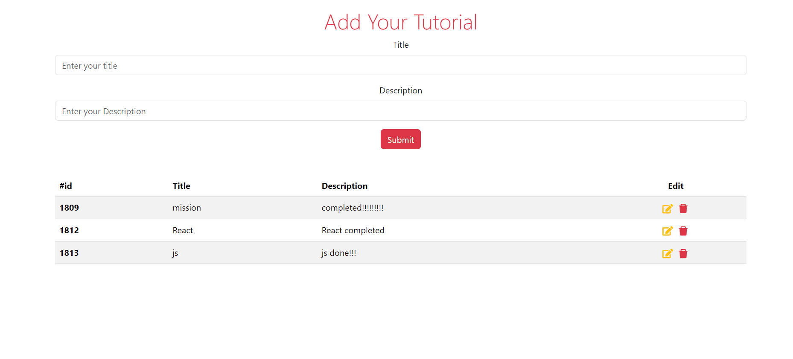
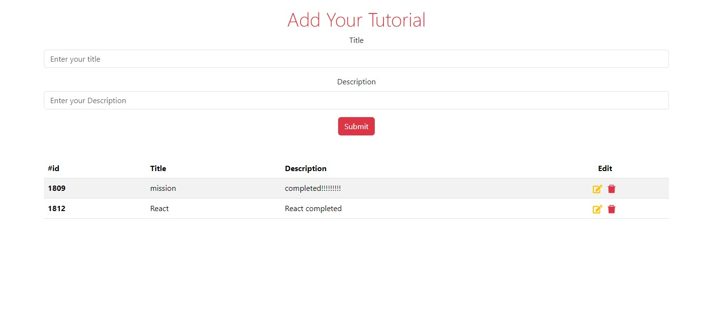
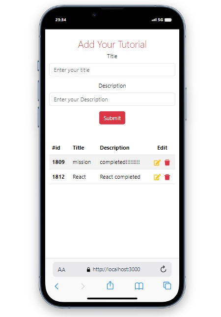
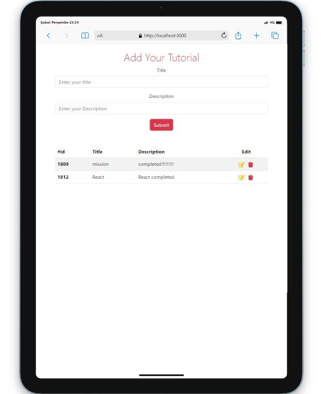

# Tutorial App

<br />
<div align="center" id="readme-top">
  <a href="#">
    
  </a>

  <h3 align="center">Tutorial App</h3>
  <p align="center">
    <a href="https://react-tutorial-app-iota.vercel.app/"><strong> 👩‍⚕️ LIVE 👨‍⚕️ »</strong></a>
    <br />
  </p>
</div>



## Description


In this project created with React, I have implemented data insertion, data update, and data deletion operations on the API used

## Features

Data is retrieved from the API using the GET operation.
Data is added to the API by performing a POST operation.
Data can be deleted from the API by executing a DELETE operation.
The data in the API can be modified by using the PUT operation.

## Screenshots



## Project Skeleton
Tutorial App(folder)
|
|----readme.md         
SOLUTION
├── public
│     └── index.html
├── src
│    ├── assets
│    │       └── [images]
│    ├── components
│    │       ├── AddTutorial.jsx
│    │       ├── EditTutorial.jsx  
│    │       └── TutorialList.jsx 
│    ├── pages
│    │       └── Home.jsx        
│    ├── App.js
│    └── index.js
├── package.json
└── yarn.lock

### Prerequisites

What things you need to install the software and how to install them:

-   Node.js
-   npm or yarn

### Installing

A step by step series of examples that tell you how to get a development environment running:

1. Clone the repo
    ```sh
    git clone [your-repo-link]
    ```
2. Install NPM packages
    ```sh
    yarn install
    ```
3. To run the project locally:
    ```sh
    yarn start
    ```

### (This command will start the development server)

## Responsive Looks




## Contact

Mehmet Doğan: mehmetseymen91@gmail.com <br>
Project Link: https://react-appointment-doctor-app.netlify.app/<br><br>
 [To see my other projects 🗂](https://github.com/Mehmet-github06) <br><br>
 <a href="readme-top" >⏫ Go Top ⏫</a>